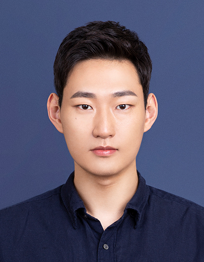
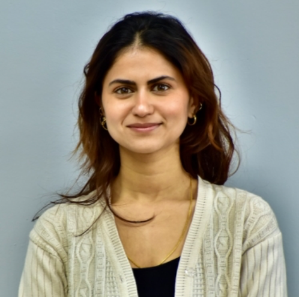
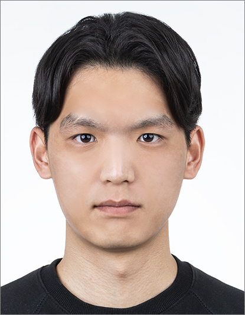
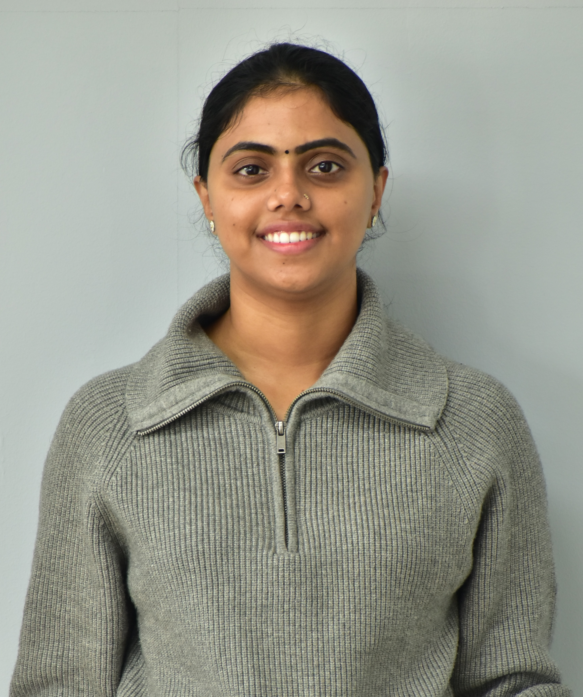
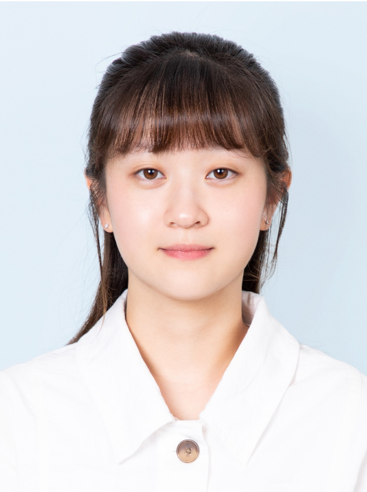
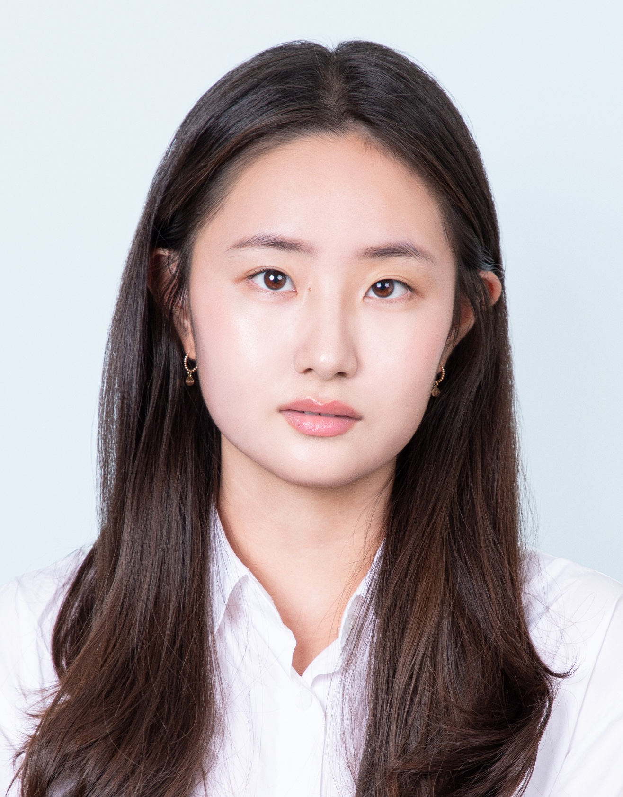
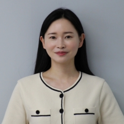

<h1> About the Global Basic Laboratory</h1>

The <strong>Global Basic Research Laboratory on the Near-term Earth System Changes and their Impacts on Economy and Planetary Health</strong> (G-Impact) is an initiative dedicated to furthering understanding of the profound links between the climate, health, ecosystem and economy. We are a diverse team across 3 institutions: IBS Center for Climate Physics, Pusan National University and Jeonbuk National University in South Korea.

<h2>Professors</h2>

  

    
    <h3>Christian Franzke</h3>
    
Professor

    
IBS Center for Climate Physics, Institute for Basic Science and Department of Integrated Climate System Science, Pusan National University

    <a class="read-more" href="{{ site.baseurl }}/team/christian-franzke/" style="font-size: 0.75rem;">Read more</a>
  
<!-- profile-card -->
  <!-- Repeat for each person -->

<!-- profiles -->

<!-- 
**Christian Franzke**

 

*Professor*  
IBS Center for Climate Physics, Institute for Basic Science and Department of Integrated Climate System Science, Pusan National University
<a href="{{ site.baseurl }}/team/christian-franzke/" style="font-size: 0.75rem;">Read more</a> -->

---

<h2>Postdoctoral Researchers</h2>

  

    
    <h3>Alexia Karwat</h3>
    
Postdoctoral Fellow

    
Research Center for Climate Sciences (RCCS), Pusan National University (PNU)

    <a class="read-more" href="{{ site.baseurl }}/team/alexia-karwat/" style="font-size: 0.75rem;">Read more</a>
  
<!-- profile-card -->

  

    
    <h3>Jeongeun Yun</h3>
    
Postdoctoral Fellow

    
Research Center for Climate Sciences (RCCS), Pusan National University (PNU)

    <a class="read-more" href="{{ site.baseurl }}/team/Jeongeun Yun/" style="font-size: 0.75rem;">Read more</a>
  
<!-- profile-card -->

  

    
    <h3>Yong-Yub Kim</h3>
    
Postdoctoral Fellow

    
IBS Center for Climate Physics (ICCP), Pusan National University (PNU)

    <a class="read-more" href="{{ site.baseurl }}/team/YongYub Kim/" style="font-size: 0.75rem;">Read more</a>
  
<!-- profile-card -->

<!-- profiles -->

<h2>Students</h2>

  

    
    <h3>Rhea Gaur</h3>
    
PhD Candidate

    
IBS Center for Climate Physics and Pusan National University

    <a class="read-more" href="{{ site.baseurl }}/team/rhea-gaur/" style="font-size: 0.75rem;">Read more</a>
  
<!-- profile-card -->

  

    
    <h3>Beomhee Jo</h3>
    
PhD Candidate

    
IBS Center for Climate Physics and Pusan National University

    <a class="read-more" href="{{ site.baseurl }}/team/beomhee-jo/" style="font-size: 0.75rem;">Read more</a>
  
<!-- profile-card -->

  

    
    <h3>Arya Vazhaparambil Sasi</h3>
    
Master's Student

    
IBS Center for Climate Physics and Pusan National University

    <a class="read-more" href="{{ site.baseurl }}/team/arya-vazhaparambil-sasi/" style="font-size: 0.75rem;">Read more</a>
  
<!-- profile-card -->

  

    
    <h3>Jiwoo Park</h3>
    
Master's Student

    
Pusan National University

    <a class="read-more" href="{{ site.baseurl }}/team/jiwoo-park/" style="font-size: 0.75rem;">Read more</a>
  
<!-- profile-card -->

  

    
    <h3>Yejin Kim</h3>
    
Master's Student

    
Pusan National University

    <a class="read-more" href="{{ site.baseurl }}/team/yejin-kim/" style="font-size: 0.75rem;">Read more</a>
  
<!-- profile-card -->

<!-- profiles -->

<h2> Administrators </h2>

    

        
        <h3>Woojin Jung</h3>
        
Administrative Assistant

        
IBS Center for Climate Physics

        <a class="read-more" href="{{ site.baseurl }}/team/woojin-jung/" style="font-size: 0.75rem;">Read more</a>
  
<!-- profile-card -->

<!-- <h2>Postdoctoral Researchers</h2>

**Alexia Karwat**  

*Postdoctoral Fellow*  
Research Center for Climate Sciences (RCCS), Pusan National University (PNU)
<a href="{{ site.baseurl }}/team/alexia-karwat/" style="font-size: 0.75rem;">Read more</a>

**Jeongeun Yun**

*Postdoctoral Fellow* 
Research Center for Cliamte Sciences (RCCS), Pusan National University (PNU)
<a href="{{ site.baseurl }}/team/Jeongeun Yun/" style="font-size: 0.75rem;">Read more</a>

---

### Students

**Rhea Gaur**  

*PhD Candidate – Climate Physics*  
IBS Center for Climate Physics and Pusan National University
<a href="{{ site.baseurl }}/team/rhea-gaur/" style="font-size: 0.75rem;">Read more</a>

---
**Arya Vazhaparambil Sasi**  

*Master's Student – Climate Physics*  
IBS Center for Climate Physics and Pusan National University
<a href="{{ site.baseurl }}/team/arya-vazhaparambilsasi/" style="font-size: 0.75rem;">Read more</a>

---

**Jiwoo Park**  

*Master's Student*  
Pusan National University
<a href="{{ site.baseurl }}/team/jiwoo-park/" style="font-size: 0.75rem;">Read more</a>

---

**Beomhee Jo**  

*PhD Student*  
IBS Center for Climate Physics and Pusan National University
<a href="{{ site.baseurl }}/team/beomhee-jo/" style="font-size: 0.75rem;">Read more</a>

--- -->

<!-- ### Administrators

**Woojin Jung**

*Administrative Assistant*  
IBS Center for Climate Physics
<a href="{{ site.baseurl }}/team/woojin-jung/" style="font-size: 0.75rem;">Read more</a>
 -->
